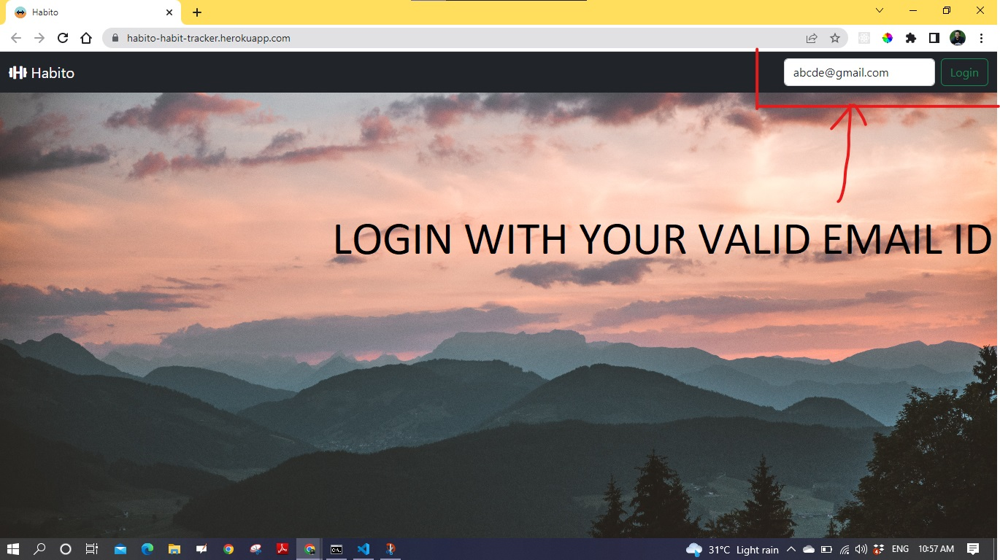
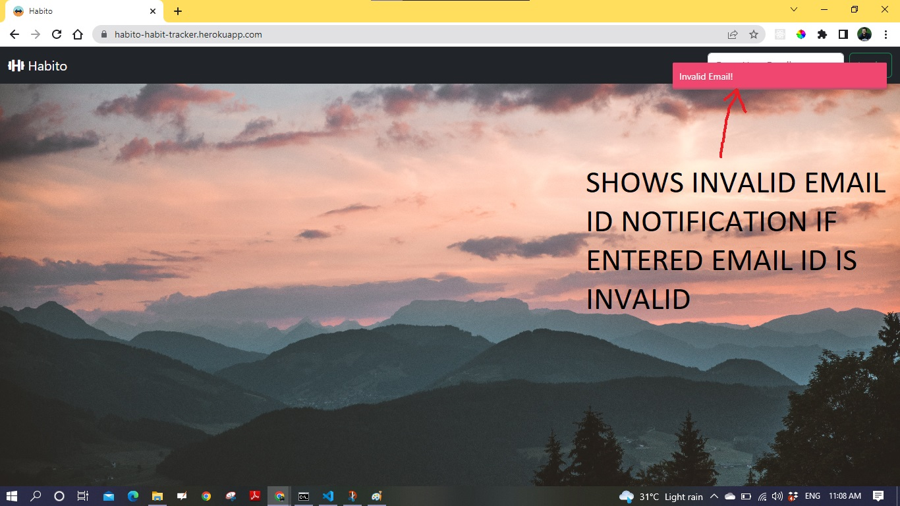
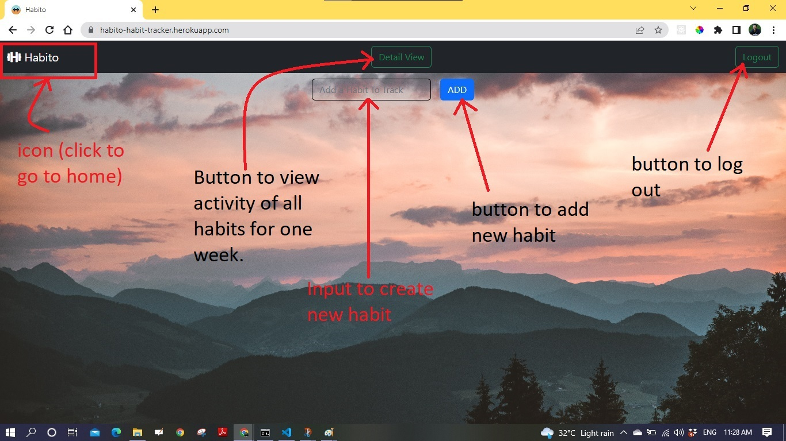

# Habito
A habit tracker app, where we can define habits and track them.

## dependencies:
connect-mongo, mongoose, cookie-parser, dotenv, ejs, express, express-ejs-layouts, express-session, nodemon, noty,connect-flash 

## Tech Stack:
- Node JS
- Express JS
- Mongo DB
- HTML, CSS
- Heroku

## Features
- Add multiple habits to track like reading a book, going to the gym etc
- Multiple habits with sama nam can not be created (Case insensitive) e.g. If a habit with name "Gym" already exists you can nou create another habit with name "gym", "gYm", "gyM", "GYm", "gYM", "GyM" or "GYM".
- Track each habit everyday. These are the 3 statuses of a habit:
    - Done - Mark the habit as done for a day
    - Not done - Mark the habit as not done for a day
    - Un-marked - User did not take any action on a habit for a day
- A view to show all current habits.
- A view to display 7 days of each habit
    - User can mark todays habit
    - Previous 6 days and the status of that habit for each day
    - A user can toggle between the three (above mentioned) statuses of a habit i.e. I can change today’s status as done, not done or none anytime.
    - Also user can change any of the previous days status i.e. I can change the status of a habit for yesterday, day before yesterday or any previous 6 days as well

# Directory Structure

```
├── README.md
├── assets
│   ├── css
│   │   └── style.css
│   ├── images
│   │   ├── background1.jpg
│   │   ├── background2.jpg
│   │   ├── background3.jpg
│   │   ├── favicon.ico
│   │   └── icon.png
│   └── js
│       ├── detailHabits.js
│       └── home.js
├── config
│   ├── connectFlashMiddleware.js
│   └── mongoose.js
├── controllers
│   ├── habit_controller.js
│   ├── home_controller.js
│   └── user_controller.js
├── index.js
├── models
│   ├── Habits.js
│   └── Users.js
├── package-lock.json
├── package.json
├── routers
│   ├── habit.js
│   ├── index.js
│   └── user.js
└── views
    ├── _footer.ejs
    ├── _header.ejs
    ├── detailHabits.ejs
    ├── home.ejs
    └── layout.ejs

```
## Features with details
<ol>
 <li><h3>Login</h3>
 <ul>
    <li><h4>log in with valid email ID</h4>
    
    </li>
    <li><h4>shows invalid email notification if email id id invalid </h4>
    
    </li>
    <li><h4>view after login</h4>
    
    </li>
 </ul>
 </li>
</ol>

  
## Git Clone
To use this repository in your local system-

<a href="https://github.com/CoderOnTheRoad/habito.git" target="_blank">https://github.com/CoderOnTheRoad/habito.git </a>

or run this command in your GitHub CLI

###### `gh repo clone CoderOnTheRoad/habito`
<br>


## <a href = "https://habito-habit-tracker.herokuapp.com/" target="_blank"> Demo / Hosted on - https://habito-habit-tracker.herokuapp.com/ </a>


